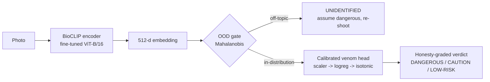

<div align="center">


# Faunari

### *Spot it. Know it. Stay safe.*

**A safety-first AI that identifies dangerous snakes from a photo — and is engineered around the one rule that matters: never tell someone a venomous snake is safe.**

[](https://github.com/dhruv7477/Faunari/actions/workflows/ci.yml)
&nbsp;·&nbsp; Python · PyTorch · scikit-learn · ONNX · React Native (Expo) · GitHub Actions

</div>

---

## The problem

India records the highest snakebite mortality in the world — an estimated **58,000 deaths a year**, most in rural areas hours from a hospital. A tool that helps a bystander judge danger *before* they get closer could save lives. But such a tool carries an unusual risk: **the cost of a wrong answer is asymmetric.** Telling someone a venomous snake is "harmless" can kill them; over-warning on a harmless snake merely inconveniences them.

So Faunari is **not** built to be "accurate." It is built to be **safe**:

| Design rule | Why |
|---|---|
| Optimise **recall on the venomous class** (target ≥ 98%) | Missing a venomous snake is the only unacceptable error |
| **Never output "safe"** | The app's most reassuring verdict is still *"keep your distance"* |
| **Default to danger** when unsure | Uncertainty resolves toward caution, not comfort |
| **Reject "not a snake"** images | It refuses to guess rather than give a false verdict |

> ⚠️ Educational prototype — **not a medical device.** Any snakebite is a medical emergency.

## What it does

1. **Point & shoot** (from a safe distance) — the app runs the photo through an on-device AI model.
2. **Get a plain-language verdict** — a colour-coded danger banner (no jargon, no species Latin), a confidence read-out, and **first-aid guidance** if the snake could be venomous.
3. **Works offline** — inference runs entirely on the phone, no connectivity needed after the one-time model download. Nothing leaves the device.

## Why this project

It's a complete, production-shaped ML system — not a notebook — that demonstrates the full arc from raw data to a shipped mobile app, with safety engineering threaded through every layer:

- **Applied ML with a real objective function** — cost-sensitive learning, probability **calibration**, decision-threshold tuning driven by recall (not accuracy), and an **out-of-distribution gate** so the model knows what it *doesn't* know.
- **Transfer learning done properly** — a domain foundation model (BioCLIP) fine-tuned on a **leakage-safe, de-duplicated** dataset with a curated hard-case set of venomous/non-venomous look-alikes.
- **On-device inference** — the trained model exported to ONNX and re-implemented in TypeScript, with a **golden test proving the phone reproduces the server model to 5 decimal places.**
- **MLOps** — a **release gate as code** (no model ships unless venomous recall clears the bar), CI on every push, Dockerised serving, and a private model-hosting + over-the-air update path.
- **Product & UX judgement** — honesty-graded verdicts, never-say-safe copy, and a clinician-review checkpoint before public release.

### Results (current model)

| Metric | Value | Note |
|---|---|---|
| Venomous recall — **test set** | **≈ 1.00** | clears the production gate (≥ 0.98) |
| Venomous recall — **hard-case set** | **≈ 1.00** | look-alike mimics; the hard part |
| Precision | ~0.5 | **intentionally low** — the app over-warns by design |
| OOD rejection | Mahalanobis gate | flags off-topic images as *"re-shoot, assume dangerous"* |

📄 Deeper reads: **[Business Case Study](docs/CASE_STUDY.md)** · **[System Design](docs/SYSTEM_DESIGN.md)** · **[Technical Deep Dive](docs/TECHNICAL_DEEP_DIVE.md)** · **[Full Roadmap](docs/PROJECT_PLAN.md)**

---

## Technical overview

### Pipeline



- **Embedder** — [BioCLIP](https://imageomics.github.io/bioclip/) (a tree-of-life ViT-B/16), with the last few transformer blocks fine-tuned for fine-grained snake danger. Frozen ImageNet features were too weak on the look-alike hard cases; a partial fine-tune closed the gap.
- **Danger head** — a cost-sensitive logistic head (venom class heavily up-weighted) with **isotonic calibration**, then a **threshold tuned for a target recall** rather than balanced accuracy.
- **OOD gate** — a Mahalanobis detector (Ledoit-Wolf shrinkage precision) fit on the snake-embedding cluster; anything far from the manifold is refused, never guessed.
- **Verdict layer** — maps calibrated probability to honesty-graded bands; the safest band still advises distance (**never "safe"**).

### On-device inference

The served model is exported for the phone and its maths re-implemented in TypeScript, with correctness *proven*, not assumed:

- `scripts/export_mobile_model.py` exports the ONNX encoder + head/OOD params as JSON, and **self-verifies** a NumPy re-implementation matches scikit-learn (head to 1e-6, OOD to 1e-13).
- A golden `selftest.json` fixture lets a **vitest test assert the TypeScript port reproduces the Python probability to 5 dp** on a real embedding.
- `scripts/parity_reference.py` produces reference verdicts for curated test images to compare desktop <-> device end-to-end.

### Engineering

- **SOLID / DIP** — concern-based packages under `src/`, wired through `Protocol` interfaces (`ImageEmbedder`, `OODDetector`, `DangerClassifier`) so components swap without touching callers, and tests inject fakes with no model load.
- **Tests** — 30 `pytest` (Python) + 15 `vitest` (TypeScript), green in CI.
- **Release gate as code** — `scripts/check_release_gate.py` blocks deploy unless venomous recall meets the bar (BRD §9.3).
- **CI/CD** — `pytest` + advisory `ruff` on every push; Docker build → GHCR; model delivered via private hosting with an over-the-air update path.

### Repository layout

```
src/
├── constants/ config/ schemas/     # paths & ids · tunable knobs · dataclasses
├── embedding/                      # ImageEmbedder Protocol + BioClipEmbedder
├── classification/  ood/           # calibrated venom head · Mahalanobis OOD gate
├── safety/                         # verdict.py (never-say-safe) + content.py (first-aid)
├── pipeline/                       # FaunariScreener: embed → OOD → classify → verdict
├── app/  training/                 # Streamlit UI · model-artifact export
mobile/                             # React Native + Expo app (on-device inference)
│   └── src/screener/               # head.ts (verified maths) · onnxScreener.ts · preprocess.ts
scripts/                            # export, release gate, parity harness
docs/  Trials/  tests/  models/     # deep-dive docs · notebooks · test suite · artifacts
```

---

## Run it

### 1 · Desktop prototype (Streamlit)

The fastest way to see the model work — full verdict logic, no phone needed.

```bash
conda activate faunari                     # Python 3.13; deps in requirements.txt
pip install -e .                           # install the src/ packages (editable)
python -m training.export                  # (re)build models/ artifacts from cached embeddings
streamlit run src/app/streamlit_app.py     # http://localhost:8501
pytest                                     # run the Python test suite
```

Or containerised:

```bash
docker build -t faunari .
docker run -p 8501:8501 faunari            # BioCLIP weights download on first run
```

### 2 · Mobile app (Android) — instant preview

Runs the real UI with a **mock** screener (placeholder verdicts) in Expo Go — no native build, no model download.

```bash
cd mobile
npm install
npx expo start                             # scan the QR with Expo Go (Android)
npm test                                   # TypeScript test suite (vitest)
```

### 3 · Mobile app — real on-device inference

On-device inference uses `onnxruntime-react-native`, a native module that needs a **custom dev build** (not Expo Go). Built in the cloud with **EAS** — no Android Studio required.

```bash
cd mobile
npm install -g eas-cli
eas login
eas build --profile development --platform android   # cloud build → installable APK
npx expo start --dev-client                          # phone + PC on same Wi-Fi
```

Point the app at your hosted model by copying `mobile/.env.local.example` → `mobile/.env.local` and setting the model URL + read token. On first launch the app downloads and caches the encoder, then runs fully offline.

> **Platform note:** iOS builds require macOS + Xcode. On Windows/Linux, target Android (EAS cloud build). Full mobile guide, including the store-release path, in **[mobile/README.md](mobile/README.md)**.

### Which path do I want?

| I want to… | Use | Needs |
|---|---|---|
| See the model's verdicts quickly | Desktop Streamlit | Python env |
| Show the app UI on a phone in 2 min | Expo Go (mock) | the Expo Go app |
| Run real AI on the phone, offline | EAS dev build | free Expo account |
| Serve it as an API/container | Docker | Docker |

---

<div align="center">
<sub>Built by <b>Dhruv Sharma</b> · safety-critical ML, calibration & OOD, on-device inference, MLOps.<br/>Educational project — not a medical device.</sub>
</div>
